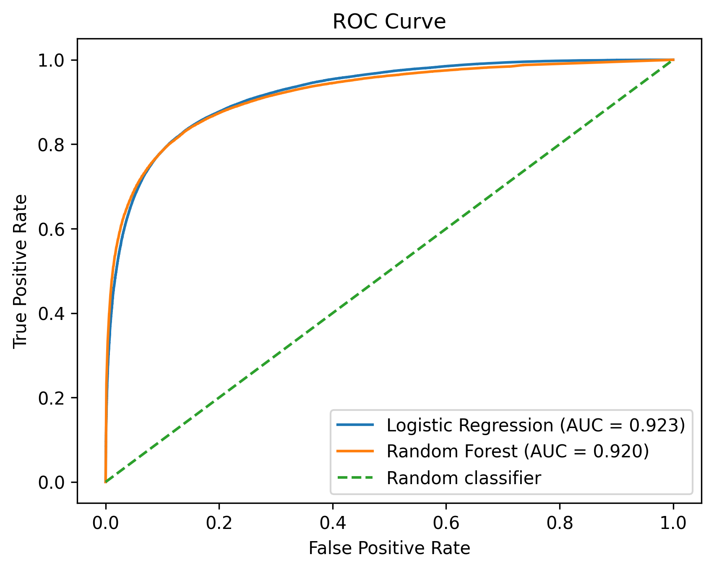

# Protein-Protein Interaction Prediction

This project builds machine-learning models to predict human protein-protein interactions using BioGRID and additional biological features.

## Features

The model uses:

- Protein expression correlation
- Gene knockout correlation
- Protein interaction network degree
- Jaccard similarity between interaction neighborhoods
- PubMed co-occurrence
- Protein domain log-likelihood ratios

## Models

Two classifiers are compared:

- Logistic Regression
- Random Forest

## Evaluation

The dataset is split into 80% training and 20% testing data.

Model performance is evaluated using:

- ROC curves
- Area Under the ROC Curve (AUC)

## Data

The raw datasets are not included in this repository because of their size.

They should be placed inside a local `Data/` folder.

## Results

- Logistic Regression AUC: 0.924
- Random Forest AUC: 0.921

